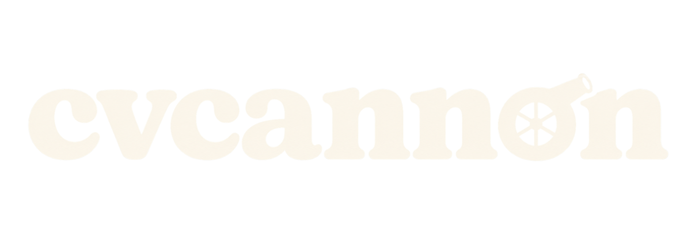

# 

**Agent framework to turn a batch of job listings into organized, polished, ATS-friendly application packs.**

cvcannon accepts several job listings at once and produces a separate tailored CV and cover letter for every role. Paste the complete listing text for the most reliable result, or provide listing links when the text is unavailable. The system organizes each application, selects relevant evidence from the candidate profile, generates the documents, exports the PDFs, and checks their technical quality.

## Bring your own harness

cvcannon is completely provider agnostic. It does not bundle, require, or call a particular AI provider. Open the repository with your preferred agent harness—Codex, Claude Code, OpenCode, or another tool that can read `AGENTS.md` and edit files—and use that agent to interpret listings and tailor the documents.

The agent supplies judgment and writing. The repository supplies the portable workflow, templates, file organization, PDF renderer, and quality checks. You can switch harnesses without migrating your profile, templates, or applications. API credentials are not required by cvcannon itself.

Launch the agent from the cloned repository root so it can discover `AGENTS.md` and work with the project files. When Docker is enabled, the agent still runs on the host. Docker commands mount that same repository at `/workspace`, perform one requested operation, write the results back into the shared folders, and exit.

It is built for turning a long list of opportunities into consistent, review-ready application packs within minutes. Reusable HTML templates, bundled static fonts, headless Chromium, and Poppler checks keep the output polished and ATS readable. The default template bundles both of its families, so the same source renders the same page on Docker, Linux, and macOS.

The included design is a starting point. Templates are intentionally customizable: typography, fonts, colors, spacing, section structure, icons, and other visual choices can be changed. Multiple named CV and cover letter template pairs can be saved and reused.

## How it works

1. Provide multiple job listings in one request. Full pasted text is preferred because it preserves the exact requirements even if a listing changes or disappears.
2. On first use, cvcannon turns an existing CV, a document, a text file, or information pasted in chat into one authoritative HTML CV.
3. cvcannon creates one organized folder per role, records a structured job analysis and a requirement-to-evidence map, and tailors a copy of the authoritative CV with the most relevant experience, skills, and terminology.
4. Each application receives a matching cover letter, two verified PDFs, and visual previews. The build rejects incomplete analysis artifacts and runs a shared factual and anti-AI writing check on both documents.
5. Review the finished application packs and submit the ones you want.

## Quick start

### 1. Open cvcannon with your agent

Clone the repository, change into its root folder, and launch your preferred agent harness there. Give the agent your existing CV or career information, job listings, or simply ask it to set up cvcannon.

On first use, the agent asks you to choose:

- **Docker:** cvcannon supplies Python, Chromium, Poppler, and system fonts in a reproducible container. You need Docker Desktop, or Docker Engine with the Compose plugin.
- **Native:** cvcannon uses Python, Chromium, Poppler, Make, and Git installed directly on your computer.

The agent saves the choice locally, performs setup, checks the environment, and uses the matching commands in later sessions. You do not need to launch repository setup scripts yourself.

Docker remains a tool runner. The agent stays in the host repository, reads `AGENTS.md`, and edits the host files.

For reference, the agent runs commands like these in Docker mode:

```bash
./docker-setup.sh
make docker-profile
make docker-new SLUG=acme-platform-engineer
make docker-build SLUG=acme-platform-engineer
```

See the [Docker guide](docs/DOCKER.md) for the complete command list and architecture.

### 2. Provide existing candidate information

Use whichever format is already available:

- drop an existing CV into `PROFILE/`;
- add a PDF, DOCX, HTML, Markdown, or text file containing career information; or
- paste career information directly into chat when working with an agent.

The agent creates `PROFILE/master-cv.html` from the supplied material. This becomes the authoritative CV used in every later session. A portrait is optional; save it as `PROFILE/portrait.png` when wanted.

The agent creates the master shell using the selected execution mode. The underlying native command is:

```bash
make profile
```

In Docker mode it uses `make docker-profile` instead.

Fill it from the supplied source material, remove unused sections and placeholders, then continue.

To start the master CV with another saved template:

```bash
make profile TEMPLATE=editorial
```

### 3. Initialize and verify the environment

```bash
make setup
make privacy
```

`make setup` configures the project and checks the required software and authoritative CV.

In Docker mode, the agent already configured the repository with `./docker-setup.sh`; after completing the master CV, it runs `make docker-doctor` and `make docker-privacy` here.

### 4. Provide one or more listings

When working with an agent, paste all listings into the same request. Separate them with headings or blank lines. Complete listing text is preferred; URLs are supported when necessary.

For direct command-line use, create a folder for each listing:

```bash
make new SLUG=acme-platform-engineer
make new SLUG=example-data-analyst
```

With Docker, use `make docker-new` with the same `SLUG` and optional `TEMPLATE` values.

To use another saved design for one application:

```bash
make new SLUG=acme-platform-engineer TEMPLATE=editorial
```

Without `TEMPLATE`, the completed master CV is copied. With `TEMPLATE`, the selected template shell is used and the agent populates it from the master CV before tailoring it.

Edit the application files:

- `APPLICATIONS/acme-platform-engineer/job-description.md`
- `APPLICATIONS/acme-platform-engineer/job-analysis.md`
- `APPLICATIONS/acme-platform-engineer/evidence-map.md`
- `APPLICATIONS/acme-platform-engineer/application-notes.md`
- `APPLICATIONS/acme-platform-engineer/cv.html`
- `APPLICATIONS/acme-platform-engineer/cover-letter.html`

Complete the analysis artifacts first, then replace every visible placeholder and all sample prose with supported, role-specific content. The full writing rules are in [the writing pipeline guide](docs/WRITING.md).

### 5. Build and review

```bash
make build SLUG=acme-platform-engineer
```

With Docker, run `make docker-build SLUG=acme-platform-engineer`.

The build creates and verifies `cv.pdf` and `cover-letter.pdf`, then renders PNG previews. Open both files under `APPLICATIONS/acme-platform-engineer/previews/` and inspect them before sending the PDFs.

## What the build verifies

- complete analysis artifacts, with no scaffold markers left;
- the shared writing checks: banned buzzwords and cover-letter clichés, em dashes, and cover-letter length;
- exactly one A4 page per document;
- static embedded fonts with no Type 3 text;
- meaningful selectable text;
- no unresolved visible placeholders or Lorem Ipsum;
- an embedded portrait when the master CV uses one;
- preview images for visual review.

Automated checks cannot judge factual accuracy, writing quality, visual balance, or whether the contact row wrapped. Human review remains required.

## Project layout

| Path | Contents |
| --- | --- |
| `BASE/TEMPLATES/<name>/` | Saved CV and cover letter template pairs |
| `ASSETS/fonts/` | Lexend and Liberation Serif fonts and licenses |
| `.cvcannon/mode` | Ignored local choice between Docker and native tools |
| `PROFILE/master-cv.html` | Authoritative candidate CV |
| `PROFILE/` | Original source files and optional portrait |
| `APPLICATIONS/` | Role-specific sources, PDFs, and previews |
| `scripts/` | Setup, generation, rendering, and verification commands |
| `docs/` | Setup, workflow, privacy, and troubleshooting guides |

## Commands

Run `make help` for the short command list. The full command contract is in [the CLI reference](docs/REFERENCE.md).

## Customize and save templates

Each template is a named folder containing `cv.html` and `cover-letter.html`. Duplicate the included bundle to create another design:

```bash
cp -R BASE/TEMPLATES/default BASE/TEMPLATES/editorial
```

Edit either HTML file freely. Fonts, colors, spacing, layout, sections, decorative elements, and print styling are all customizable. Keep both documents printable as one A4 page with selectable text and use local or embedded assets so PDF generation remains reliable.

List saved templates with:

```bash
make templates
```

Template names use lowercase letters, digits, and hyphens. Add redistributable static font files and their licenses under `ASSETS/fonts/`, embed suitable font data, or use a system font stack.

## Documentation

- [First-time setup](docs/SETUP.md)
- [Docker setup and commands](docs/DOCKER.md)
- [Application workflow](docs/WORKFLOW.md)
- [Application writing pipeline](docs/WRITING.md)
- [Privacy model and safe publishing](docs/PRIVACY.md)
- [Command reference](docs/REFERENCE.md)
- [Troubleshooting](docs/TROUBLESHOOTING.md)
- [Agent operating rules](AGENTS.md)

## License

cvcannon is available under the [MIT License](LICENSE). Lexend and Liberation Serif are licensed separately under the SIL Open Font License 1.1; see [third-party notices](THIRD_PARTY_NOTICES.md).
